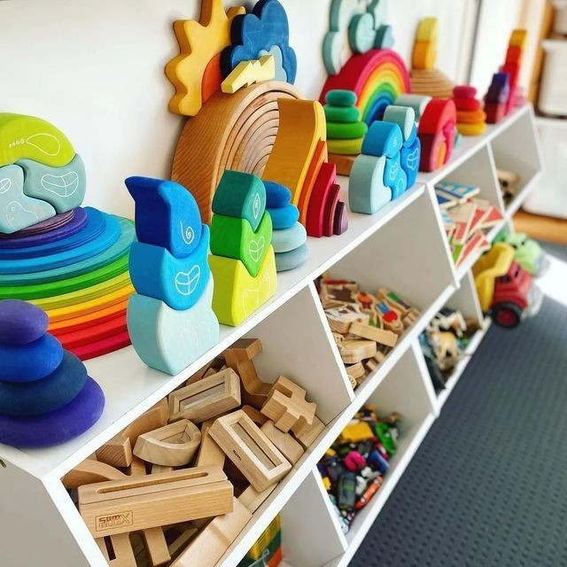
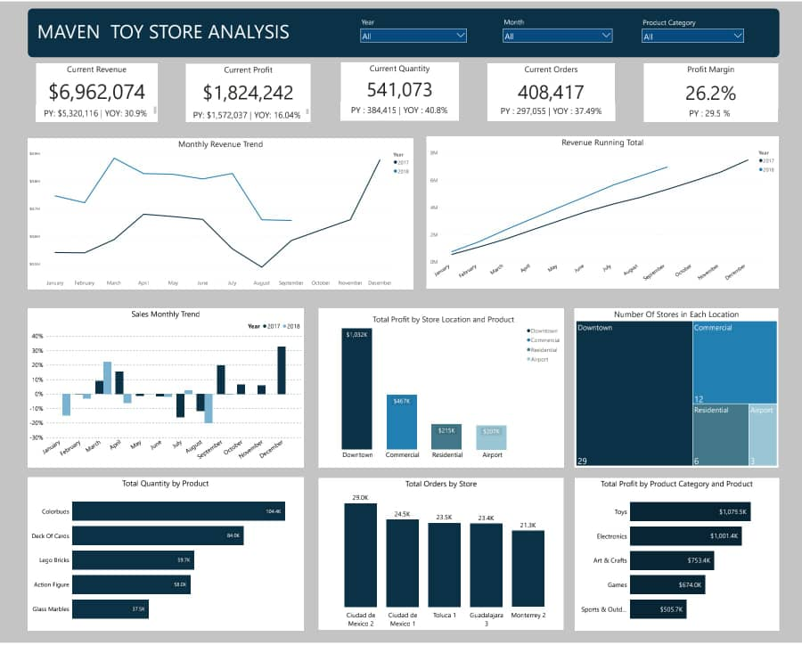

# Toy Store Analysis

___

## Introduction
___

I have been hired as a BI consultant by Maven Toys, to analyse interesting patterns and trends in their data and help them make informed decisions, as they look to expand their business with new stores, thereby creating new opportunities to drive sales .
___

## Problem Statement
____

These are the  questions this Analysis/ Report aims to answer;
1.	Display an up-to-date Key Performance Indicators(KPI)
   
2.	What trends, patterns, or seasonality can be identified? Monthly comparison
	
3.	Which product categories drives the biggest profits?, is it the same across all store locations?

4.	What is the Year over Year Comparisons?
___

## Skills Demonstrated
___

The following Power Bi features were incorporated;

- Data Analysis Expression(DAX):
  
- Quick measures, Calculated Columns
  
- Data cleaning and exploration with Power Query
  
- Time Intelligence analysis
  
- Filters and Drill downs effect
___

## Data Sourcing
___

This is a Dummy dataset which was downloaded from Maven Analytics Website.
The dataset contains 4 tables in CSV format:

**The Products table** contains the products sold at Maven Toys with fields containing details about the product category, cost, and retail price.

**The Store table** contains the Toys store locations , with fields containing details about the store location, type, and date it opened.

**The Sales table** contains the units sold in sales transactions from January 2017 to October 2018 (each record represents the purchase of a specific product at a specific store on a specific date).

**The Inventory table** contains the stocks at hand of all products available in each store
___

## Data cleaning and Transformation
___

Data cleaning and transformation was efficiently done with the power query editor, Steps applied include;

1.	Checking for Duplicates, missing data and inconsistences in dataset, whereby none was found,
   
2.	Calculating the Total profits by ;

- Merging the Product table with the Sales table, i  retained the product price and Product cost column from the Product table,
- Multiplying each column with the Units column in a new column to get the Total price and Total cost simultaneously.
- Then subtracting the Total cost from the Total Price to obtain the Total profit made.

.png)
___
     
## Data Modelling
___

Power BI automatically connected related tables resulting in a Combination Star and Snowflakes Schema with the Merged Sales table being the fact table while Product and Store tables were the Major dimensions table, and the inventory table is the minor dimension table connected to them. I also created the Calendar date table to enable time intelligence analysis.

.png)

____

## Analysis / Visualization
___

I created quick measures for Total quantity sold, Total revenue, Total Orders, Profit Margin and also their Year over Year  Comparison in order to carried out the analysis displayed in the report below. 
View DAX code [here](DAXFORMULAS)

i applied the Drill down effect in the Visualisation of Total profit by store location and Total profit by Product category respectively. once interacted, it would share more information.
you can interact with the report [here](https://app.powerbi.com/groups/me/reports/3802bf0c-3bb0-446c-8716-9a580cc222d9/ReportSection77a9e716a568195ab815?experience=power-bi&redirectedFromSignup=1)

___

## Insights
___

1. The analysis shows an Increase across the Key Performance Indicators (KPI)  as compared to the previous year.

2. The Running Total Revenue trend shows a monthly improvement in sales, but a consistent decline is observed  between July and August as compared to other months on the Monthly revenue trend.

3. The Airport location has the least number of stores, but has two (2) out of its three (3)stores are among the most profitable.

4. Colorbuds from the Electronics category made the most profit ,followed by Action figures and Lego Bricks from the Toys category.

5. Toys category were the most profitable, while the Arts and Crafts category sold the highest quantity.

6. Downtown location generated the most profit.
 ____

## Recommendation
___

1. Data Collection should also include information like Customer Demography, for an in-depth analysis into discovering the reason(s) behind sales decline and create necessary solutions.

2. Airport location can become a promising location to create new stores as most of its stores has the highest orders and profits compared to stores in other location.

3. The Products such as Colorbuds,Action Figures, Lego Bricks and Deck of cards, which are popular and generated more profit should be prioritize in the new stores.

4. Product review measures such as price increment,Additional toy accessories and Value placement for the products in Arts and Craft category to improve their profit margin.

